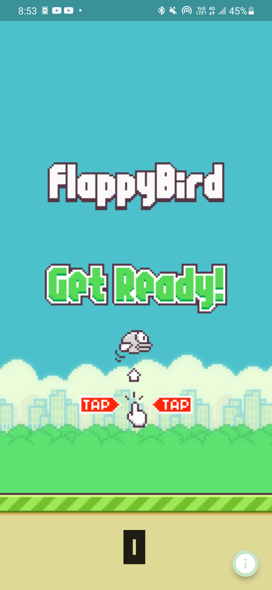
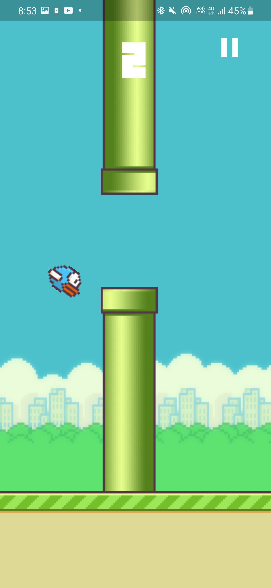
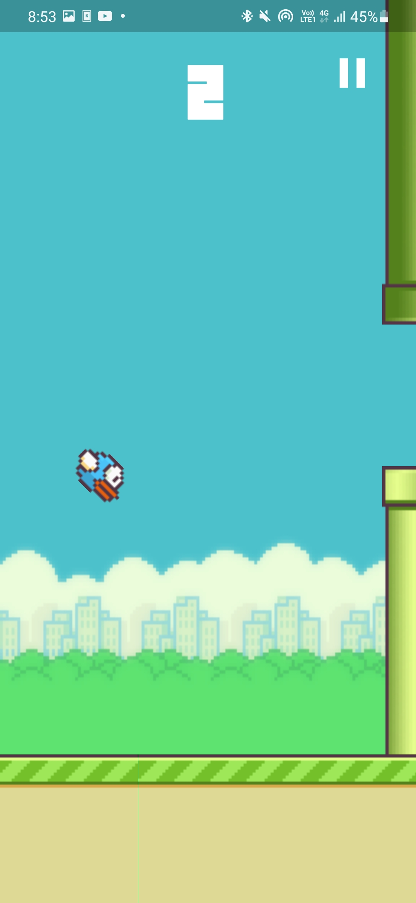

# Flappy

Flappy Birds (but in Flutter)

## Features

- Only a single pair of Pipes spawn
- You can manually scroll the base when game is paused (lol)

## Compatibility

- For compatibility with AudioPlayers library, the project uses version 4.x of Kotlin, so first build may take some time.

## Screenshots

